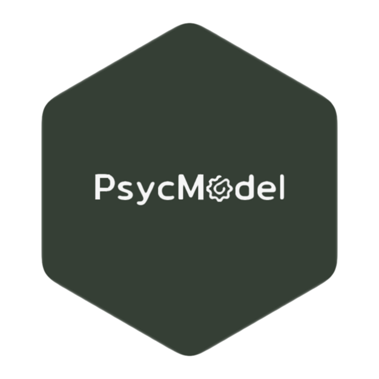

# psycModel  <a href='https://jasonmoy28.github.io/psycModel/'></a>

## Integrated Toolkit for Psychological Analysis and Modeling in R

<!-- badges: start -->
[](https://cran.r-project.org/package=psycModel)
[](https://github.com/jasonmoy28/psycModel/actions)
[](https://codecov.io/gh/jasonmoy28/psycModel?branch=master)
[](https://cran.r-project.org/package=psycModel)
<!-- badges: end -->

# Installation

**CRAN Stable Version**
```R
install.packages('psycModel')
```
**Dev Version (newest feature)**
```R
devtools::install_github('jasonmoy28/psycModel')
```
## Key Features
<span style="color:#009900">✓</span> A beginner-friendly R package for statistical analysis in social science (intermediate & advanced R users should also find it useful) <br/>
<span style="color:#009900">✓</span>  Tired of manually writing all variables in a model? You can use [dplyr::select()](https://dplyr.tidyverse.org/reference/select.html) syntax for all models <br/>
<span style="color:#009900">✓</span> Fitting models, plotting, checking goodness of fit, and model assumption violations all in one place. <br/>
<span style="color:#009900">✓</span> Beautiful and easy-to-read output. Check out this [example](https://jasonmoy28.github.io/psycModel//articles/quick-introduction.html) now. <br/>
<span style="color:#009900">✓</span> In the backend, this package uses reliable R packages (e.g., `lavaan`, `lme4`, `psych`) to handle all statistical analysis. <br/>

## Supported Models
Regression models:  <br/>
* Linear regression (i.e., support ANOVA, ANCOVA)  & generalized linear regression  <br/>
* Linear mixed effect model (i.e., HLM, MLM)  & generalized linear mixed effect model.  <br/>

Structure Equation Modeling:  <br/>
* Exploratory & confirmatory factor analysis  <br/>
* Measurement invariance (MGCFA approach)  <br/>
* Mediation analysis (SEM approach) <br/>

Other:  <br/>
* Descriptive statistics 
* Correlation (e.g., pearson, polychoric, tetrachoric, spearman), 
* Reliability analysis <br/>

<br/>

*Note:* If you like this package, please considering give it a star on [GitHub](https://github.com/jasonmoy28/psycModel). I would really appreciate that.

## Credit
**Authors:** [Jason Moy](https://jasonmoy.us)

**Citation:** Moy, J. H. (2021). psycModel: Integrated Toolkit for Psychological Analysis and Modeling in R. *CRAN*. https://cran.r-project.org/package=psycModel.

**Logo Design:** Danlin Liu

## Upcoming Features
1. Support bootstrapping and robust standard error for relevant models 
2. Support moderated mediation analysis and multilevel mediation analysis (currently support multilevel with level-1 variable only)
3. Support latent class and profile analysis (possible latent transition analysis)
4. Support generalized linear regression
5. Support polynomial regression
6. Support outputting table to MS word (don't know how to implement yet)  

*Note:* A more exhaustive list is available [here](https://github.com/jasonmoy28/psycModel/issues/3). If you have any feature request, please feel free to let me know by writing a new GitHub issue. 


## Disclaimer:
The current release is the [alpha version](https://en.wikipedia.org/wiki/Software_release_life_cycle#Alpha) of the package since I plan to add more features and support more models in the future (read more about planned updates [here](https://github.com/jasonmoy28/psycModel/issues/3)). If you are interested in help building this package, please feel free to submit a [pull request](https://github.com/jasonmoy28/psycModel/pulls) / [GitHub issue](https://github.com/jasonmoy28/psycModel/issues). Although I tried my best to fix any bugs, the package is not guarantee to be bug-free. If you find any bugs, please submit them in the [GitHub issue](https://github.com/jasonmoy28/psycModel/issues). Although the package is depended on reliable R packages for all statistical analysis, I still encourage validating the output of this package with another statistical software (e.g., SPSS, MPlus, Python). This package is licensed under the [GPLv3 liscense](https://www.gnu.org/licenses/gpl-3.0.en.html). You may use, re-distribute, and modified the package. Additionally, this package does provide any kind of warranty, either expressed or implied based on the GPLv3 liscense. Finally, you should expect many changes that are not backward compatible until the package's first major release (i.e., v1.0.0). 

## Acknowledgement
This package was built by standing on the shoulders of giants with special thanks to researchers and developers of [`lavaan`](https://lavaan.ugent.be/), [`lme4`](https://github.com/lme4/lme4), [`lmerTest`](https://github.com/runehaubo/lmerTestR), [`nlme`](https://cran.r-project.org/package=nlme), [`performance`](https://easystats.github.io/performance/), [`parameters`](https://easystats.github.io/parameters/), [`psych`](https://personality-project.org/r/psych/), and of course, all of the [`tidyverse`](https://tidyverse.tidyverse.org/) packages. I hope this package can help someone in the same way that these packages has helped me. 

## Code of Conduct
Please note that the psycModel project is released with a [Contributor Code of Conduct](https://jasonmoy28.github.io/psycModel//CODE_OF_CONDUCT.html). By contributing to this project, you agree to abide by its terms.
