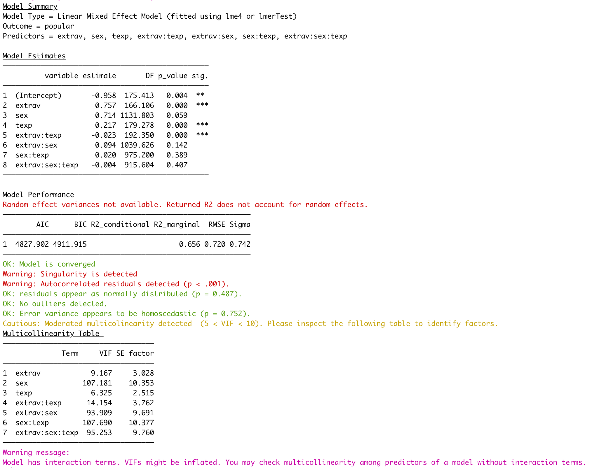
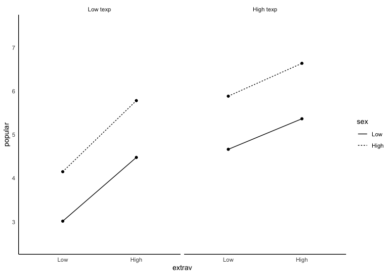
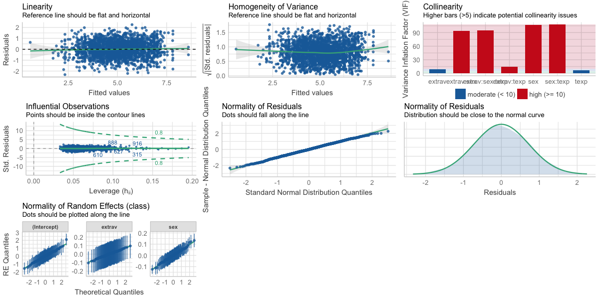

```{r, include = FALSE}
knitr::opts_chunk$set(message=FALSE,warning = FALSE, comment = NA)
```

```{r setup}
library(psycModel)
```

## Brief introduction to `model_summary_with_plot`
This function integrated all the functionality related to regression in this package. First, I am going to fit a HLM model using the `popular` dataset. The `popular` dataset is a classic data-set from Chapter 2 of Joop Hox’s Multilevel Analysis (2010). The popular dataset included student from different class (i.e., class is the nesting variable). The outcome variable is a self-rated popularity scale. Individual-level (i.e., level 1) predictors are sex, extroversion. Class level (i.e., level 2) predictor is teacher experience (?popular for a more detailed description)

First, let's take a took at the data-set itself. As you can see, it has 6 variables and 2000 rows. 
```{r}
popular %>% dplyr::glimpse()
```
Now, let starting fitting the model. By default, it is going to use the `lmerTest` package. And, it support `dplyr::select` syntax for all variables. I used the `:` to select all the variables between extrav and sex (i.e., extrav, texp, and sex).  

However, it also support more versatile verb like `tidyselect::everything` or `tidyselect::contains`. For example, if your dataset only consists of variable for response variable , random effect factors, and id. Then, you can pass `tidyselect::everything` to the `random_effect_factors` argument. Wait a second. If I use `tidyselect::everything`, won't the `response_variable` and `id` also treated as the `random_effect_factor` and booooom, the function break? Actually not, the function is designed to take out response variable and id if they are passed into all other factors (i.e., random and non-random effect factors and all interaction factors). Essentially, if you are more of a code guy, `c(everything(), -c(response_variable, id))` is same as `everything()`. 

```{r,eval=FALSE}
 fit <- model_summary_with_plot(
   data = popular,
   response_variable = popular,
   random_effect_factors = c(extrav, sex),
   non_random_effect_factors = texp,
   three_way_interaction_factor = extrav:sex, # here, I used the :
   id = class
 )
```
Whooo, finally, let's see the output  

{width=100%} 
*Note that this is not generated dynamically, but rather insert as a static image for better viewing experience*  

The first section tells your the model type. In this case, it is the linear mixed effect model (fitted using lmerTest). The predictors are extrav (extraversion), sex, texp (teacher experience), and all interaction terms. The second section give you fixed effect estimate. The third section give you model performance like AIC, BIC, $R^2$. The forth section gives you assumption checks. As you can see, the model convergence is ok, but the model has a boundary fit (i.e., singular). It also gives you a multi-collinearity table if multi-colinearity is detected. As you can see from the warning, multi-colinearity may not be accurate since we included a interaction term. So, you can try removing the interaction term and re-fit the model. Last, since you included an interaction, it will print a two-way interaction plot which can be print in color if you set `plot_color = T`
{width=100%} 
*Note that this is not generated dynamically, but rather insert as a static image for better viewing experience*

However, as we all know, there are a lot of problems with p-value. Although I think `performance` (the package that I used to check model assumption violation) have done a great job to determine whether model assumptions are violated. It is usually recommended to visually inspect the plots to determine whether there's true violation. It is easy to do that by using adding `assumption_plot = T` to the function. The generated plot is shown below 
```{r results='hide',eval=FALSE}
 fit <- model_summary_with_plot(
   data = popular,
   response_variable = popular,
   random_effect_factors = c(extrav, sex),
   non_random_effect_factors = texp,
   three_way_interaction_factor = extrav:sex, # here, I used the `:` symbol
   id = class,
   assumption_plot = T
 )
```
{width=100%} 
*Note that this is not generated dynamically, but rather insert as a static image for better viewing experience*
